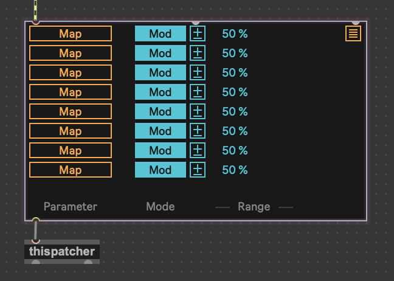
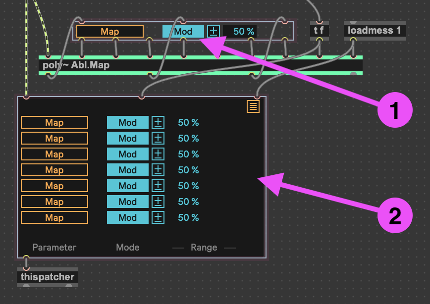

# m4l-mapper
Reusable, simplified multi-mapping bpatcher for Max for Live devices



## Reason for Living

### The Problem
The multimapper component that comes with Live 12 is a great improvement over what was in the prior version, with CPU usage reduction and support for the new modulation mode.

However, integrating it into a Max for Live device is more complex than it needs to be. 

Here is the multi-mapper impelementation in the Live 12's stock LFO device:



There is a single mapper `[bpatcher]` [1] that is always visible, and must be placed "in front" of the large `[bpatcher]` [2], since it sits in the empty row above the seven other modulation mappers in presentation. The large `[bpatcher]` must be second in the z-order of the presentation of the device so that it may cover the other UI elements of the device when expanded, but not hide the one in the top row.

There are a total of six objects and 18 patch cords in this implementation.

### The Improvement
There is an opportunity to simplify the design of this component by having the large `[bpatcher]` host all eight mappers.


There are now only two objects and two patch cords required in the device - the input signal, and a connection to `[thispatcher]` so that the `[bpatcher]` can expand vertically when required. This `[bpatcher]` can sit in front of all other objects, eliminating the need to maintain a "second in order". 

## Integrating Into Your Device
Clone this repo into a directory in Max's search path.

The most reliable place to have it is under `~/Documents/Max 8/Packages/`, since that path is part of Max's standard set of search paths.

If you want to extract it elsewhere, make sure to configure Max to use that directory too (and include subdirectories).

e.g.
```
cd ~/Documents/Max\ 8/Packages/
git clone github.com:zsteinkamp/m4l-zs.mapper
```

You should be able to then create a `[bpatcher]` object in your device and have it use `zs.mapper` as its patcher.

## Acknowledgments
Thanks to the Ableton / Cycling 74 teams for improving the mapper for better CPU utilization through the creative use of `[poly~]`, as well as keeping the stock devices editable so that people like me may learn from them!
